# :fire: Calorie Tracker - Multi-Module Architecture App

## Project Structure :dart:

The project is divided into 6 modules:
- `app` - the main module, which contains the `MainActivity` and the `App` class.
- `core` - the core module, which contains all shared code between the modules. Contains data like classes that need in a lot or in all modules, share logic or share clases that could be use in other modules
- `core-ui` - the core-ui module, which contains all shared UI code between the modules.
- `onboarding` - the onboarding module, which contains the onboarding screens.
- `tracker` - the tracker module, which contains the tracker screens, such as the Overview screen and the Search screen.
- `buildSrc` - the module that contains the dependencies and the versions of the libraries used in the project. For build specific configurations.

```
CalorieTrackerApp/
├── :app
│
├── :core
│
├── :core-ui
│
├── :onboarding
│   ├──:onboarding_domain
│   └──:onboarding_presentation
│
└── :tracker/
    ├──:tracker_data
    ├──:tracker_domain
    └──:tracker_presentation
```

> :bulb: The app create by modularization is very hard to build and you must to put much effort the first time. But after that, you will have a very good architecture and you will be able to add new features very fast.
> You can create your application using a single module, and if your app growth you can modularize your app to work with a large team.


To learn more about the project structure, check out the [Architecture Guide](architecture-guide.md).

## Screenshots :camera:

| Onboarding                                                            | Overview                                      | Search                                    |
|-----------------------------------------------------------------------|-----------------------------------------------|-------------------------------------------|
| 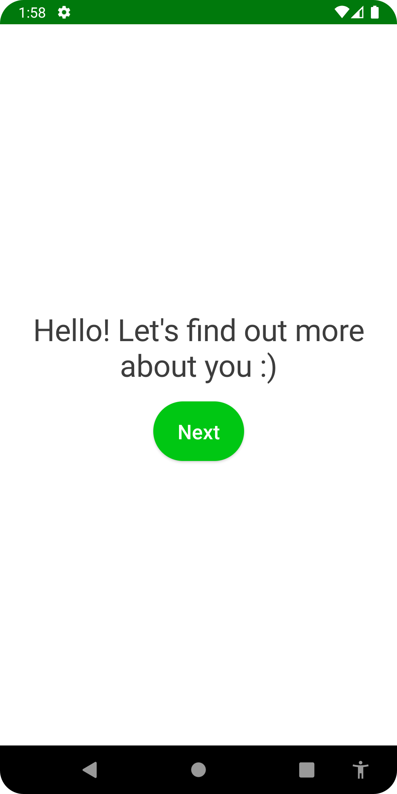             | 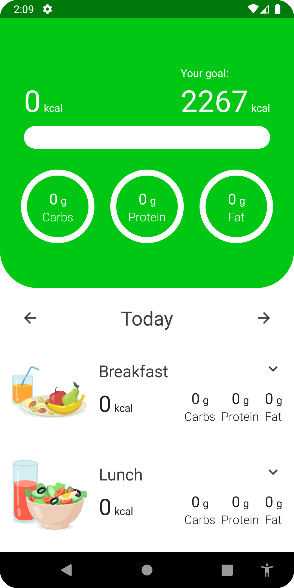         | 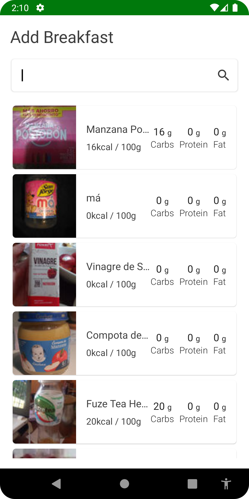         |
| 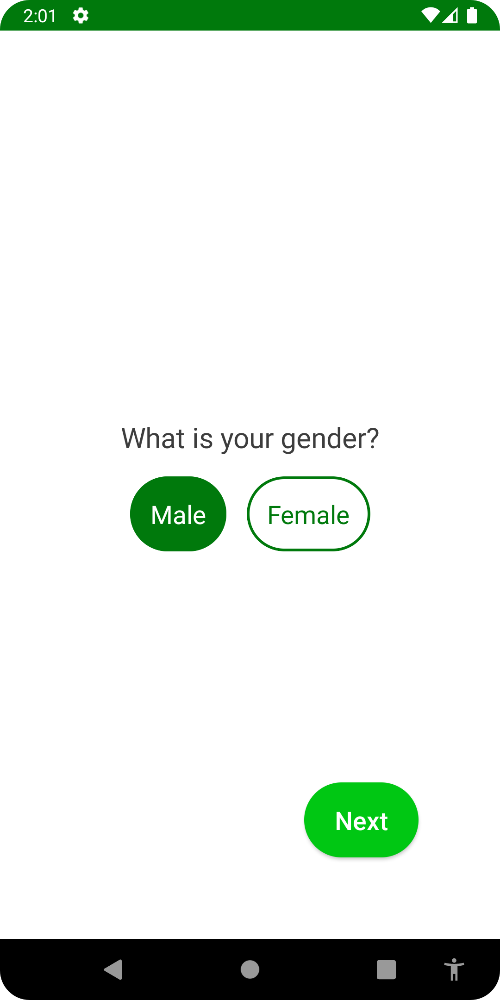               | 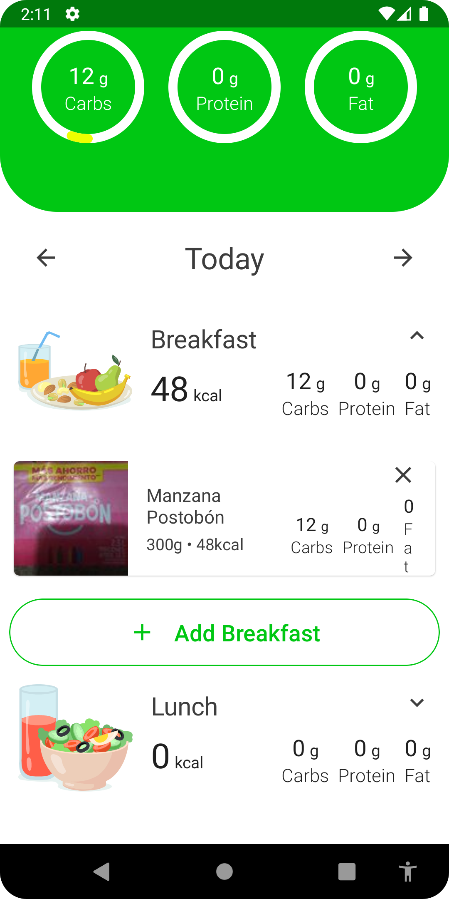 | 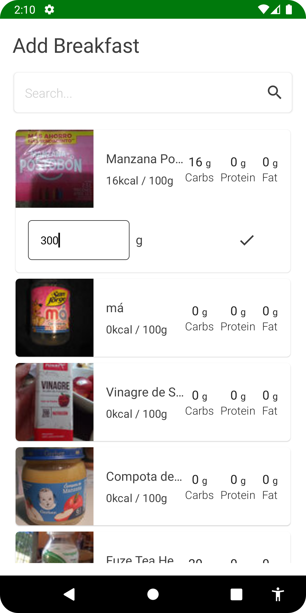 |
| 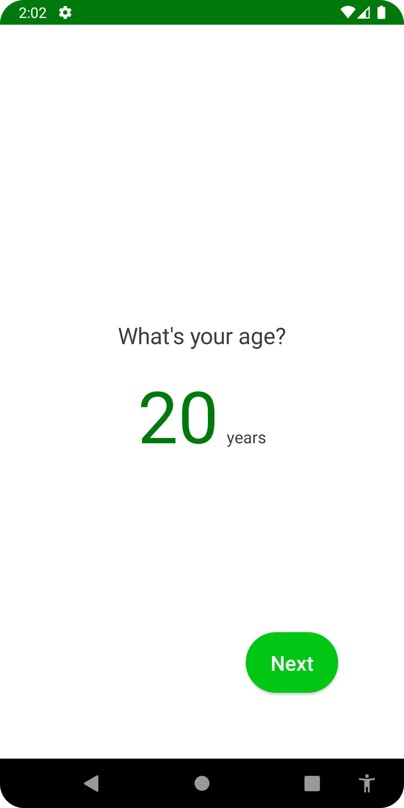                     |                                               |                                           |
| 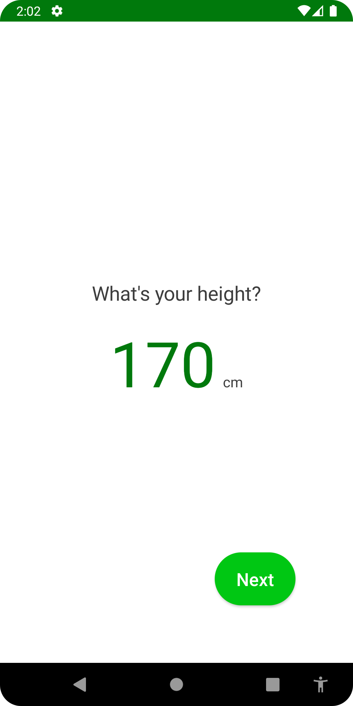               |                                               |                                           |
| 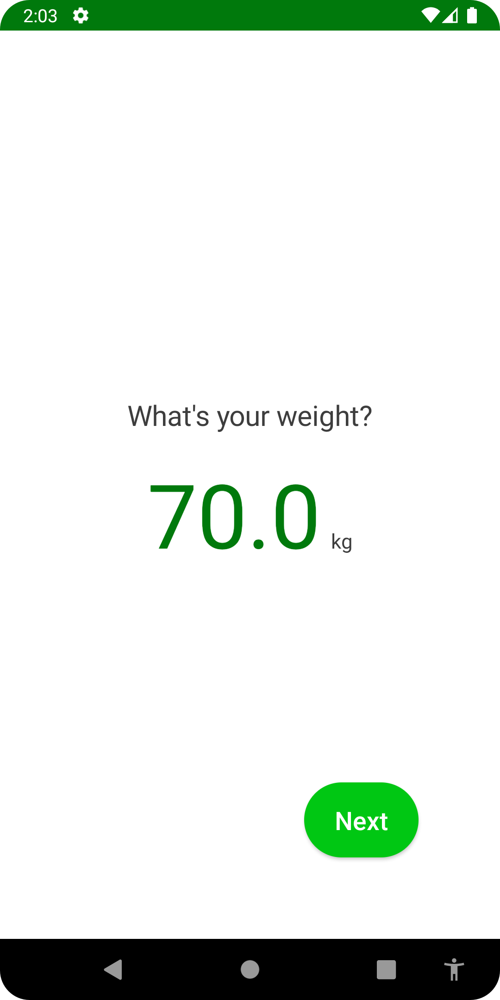               |                                               |                                           |
| 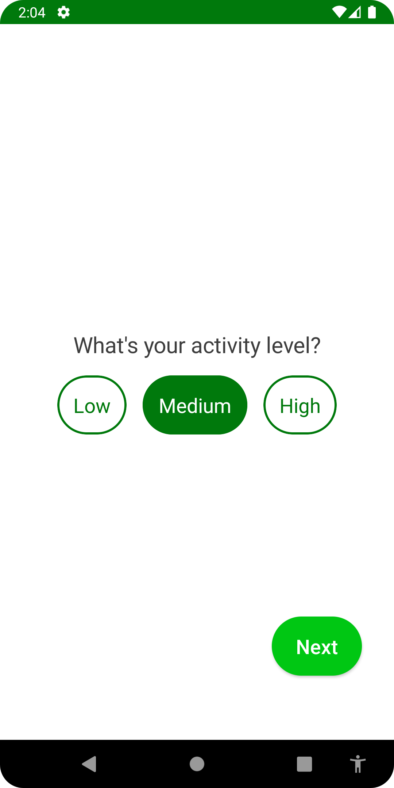           |                                               |                                           |
| 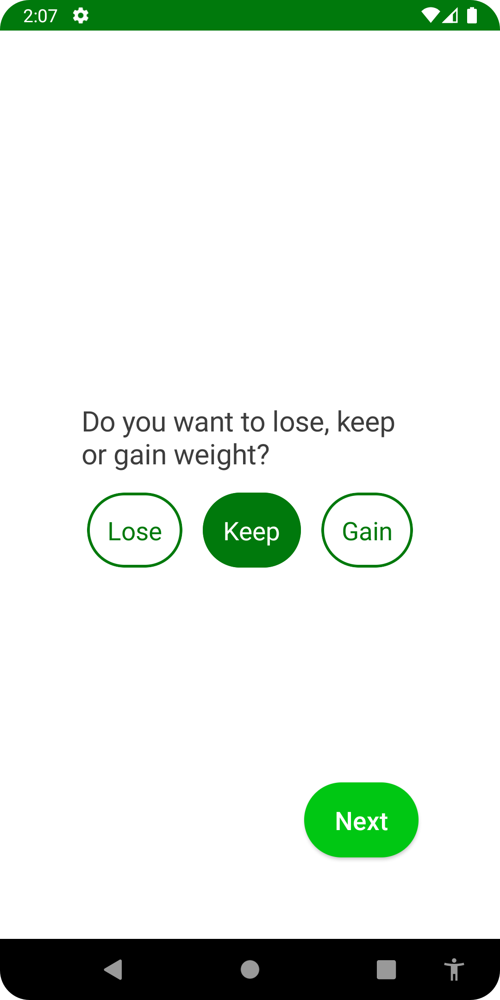                   |                                               |                                           |
| 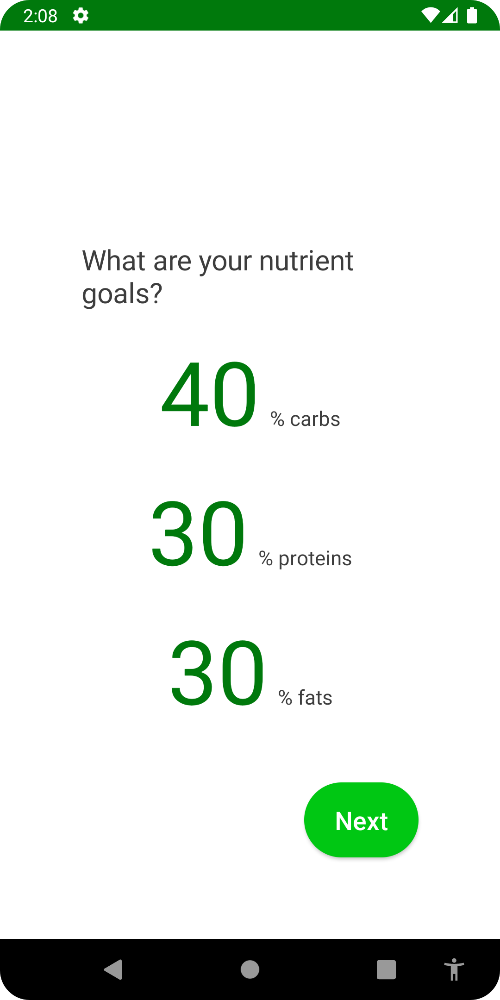 |                                               |                                           |


## Libraries Used :books:

- [AndroidX](https://developer.android.com/jetpack/androidx)
- [Coil](https://coil-kt.github.io/coil/)
- [Compose](https://developer.android.com/jetpack/compose)
- [Coroutines](https://developer.android.com/kotlin/coroutines)
- [Dagger Hilt](https://dagger.dev/hilt/)
- [Material Components](https://github.com/material-components/material-components-android)
- [Kotlin](https://kotlinlang.org/)
- [Moshi](https://github.com/square/moshi)
- [Retrofit](https://square.github.io/retrofit/)
- [Room](https://developer.android.com/topic/libraries/architecture/room)
- [Navigation](https://developer.android.com/guide/navigation)
- [MockK](https://mockk.io/)
- [Espresso](https://developer.android.com/training/testing/espresso)
- [Robolectric](http://robolectric.org/)
- [Truth](https://truth.dev/)
- [MockWebServer](https://github.com/square/okhttp/tree/master/mockwebserver)
- 